---
# Software Engineering Methods
## Group members:
- [Jinson (Scrum Master)](https://github.com/JinnyT)
- [Kenneth](https://github.com/Kenifvt)
- [Artur](https://github.com/artpac)
- [David (Project Owner)](https://github.com/rereversed)

Main Build Status 

Develop Branch Status 

License 

Release 

---

## Steps in contributing !!
1. **Always keep your brances up to date!!** (might make a script for it later)
2. Then, it’s best practice to create a separate branch inside of feature for each new pull request (PR) you create. This can be done using:
   ~~~ 
    git checkout -b feature/name_of_your_branch
   ~~~ 
3.Start working on the assigned tasks, and open a PR as soon as you have a full or partial solution, when you open the PR make sure to follow the [conventional commits format](https://www.conventionalcommits.org/en/v1.0.0/), and then directly reference the issue in the pull request by adding the following content to the description of the PR:
~~~ 
    Close #Issue_number
~~~
4. Wait for your PR to be reviewed by at least one other team member. Based on the feedback, you may either merge your PR (if approved) or make the necessary adjustments. Only merge your PR into the **develop** branch once approval has been given.
5. During the PR review process, the other team member should focus on the code quality, functionality, and whether the PR effectively addresses the issue it is linked to. Reviewers should provide constructive feedback to promote continuous improvement. This is important so when it is time for the main Code Reviews we can perform well !
6. Upon receiving approval, merge your changes into the **develop** branch. Ensure to pull the latest changes from develop and resolve any conflicts before the final merge to maintain a stable code base.
7. Features merged into develop will be periodically reviewed and tested as a part of the preparation for merging into the main and then release branches ! ✈️

---

# Requirements Table:
[Some Screenshots have been cut short to fit on the table]

| ID | Name                                                                                                  | Met     | Screenshot                         |
|----|-------------------------------------------------------------------------------------------------------|---------|------------------------------------|
| 1  | All the countries in the world organised by largest population to smallest.                           | yes     | 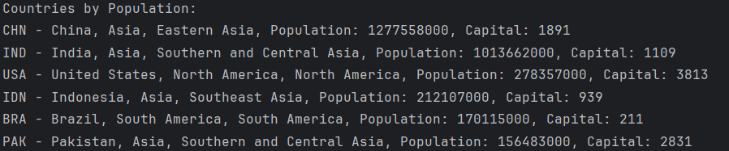  |
| 2  | All the countries in a continent organised by largest population to smallest.                         | yes     |   |
| 3  | All the countries in a region organised by largest population to smallest.                            | yes     | 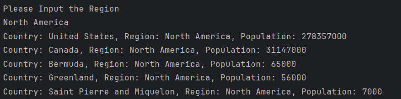  |
| 4  | The top N populated countries in the world where N is provided by the user.                           | yes     | 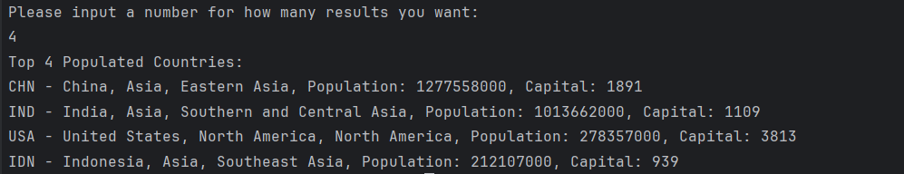  |
| 5  | The top N populated countries in a continent where N is provided by the user.                         | yes     | 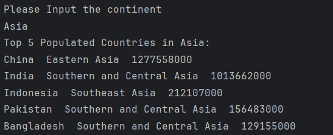  |
| 6  | The top N populated countries in a region where N is provided by the user.                            | yes     | 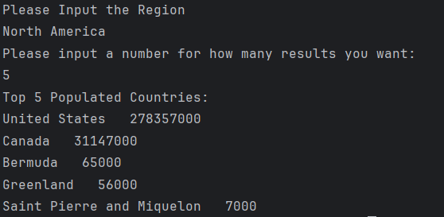  |
| 7  | All the cities in the world organised by largest population to smallest.                              | yes     |   |
| 8  | All the cities in a continent organised by largest population to smallest.                            | yes     | 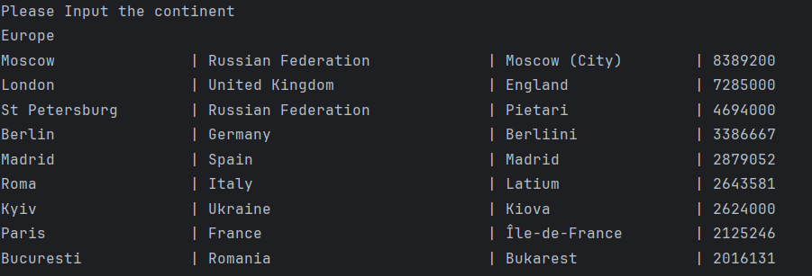  |
| 9  | All the cities in a region organised by largest population to smallest.                               | yes     | 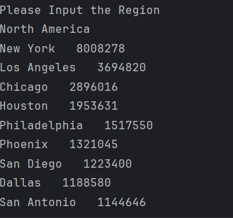  |
| 10 | All the cities in a country organised by largest population to smallest.                              | yes     | 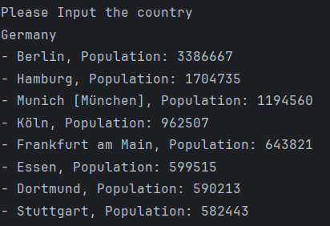 |
| 11 | All the cities in a district organised by largest population to smallest.                             | yes     | 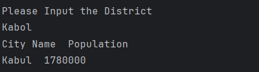 |
| 12 | The top N populated cities in the world where N is provided by the user.                              | yes     |  |
| 13 | The top N populated cities in a continent where N is provided by the user.                            | yes     | 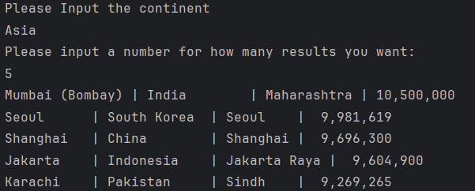 |
| 14 | The top N populated cities in a region where N is provided by the user.                               | yes     | 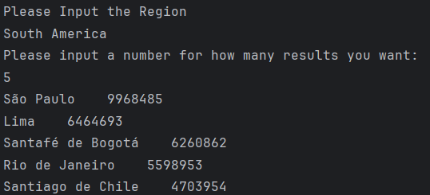 |
| 15 | The top N populated cities in a country where N is provided by the user.                              | yes     | 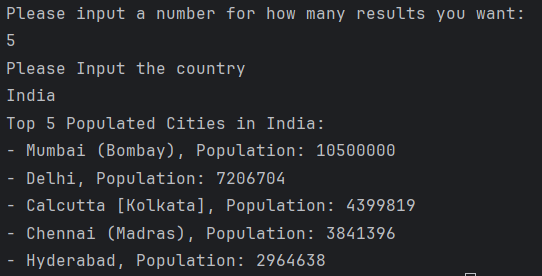 |
| 16 | The top N populated cities in a district where N is provided by the user.                             | yes     | 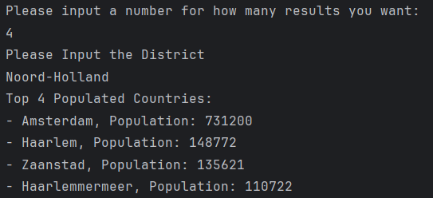 |
| 17 | All the capital cities in the world organised by largest population to smallest.                      | yes     | 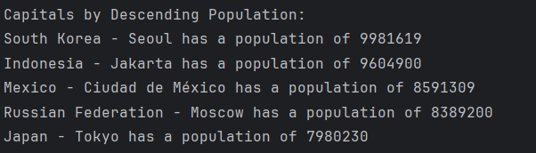 |
| 18 | All the capital cities in a continent organised by largest population to smallest.                    | yes     | 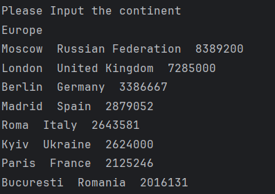 |
| 19 | All the capital cities in a region organised by largest to smallest.                                  | yes     | 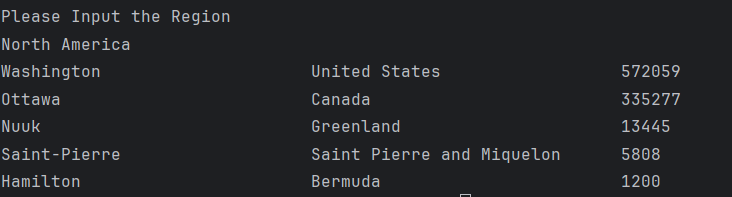 |
| 20 | The top N populated capital cities in the world where N is provided by the user.                      | yes     | 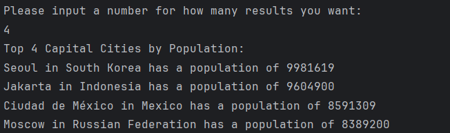 |
| 21 | The top N populated capital cities in a continent where N is provided by the user.                    | yes     | 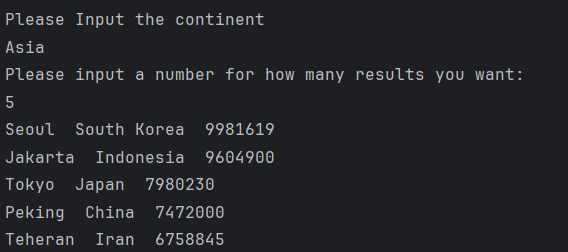 |
| 22 | The top N populated capital cities in a region where N is provided by the user.                       | yes     | 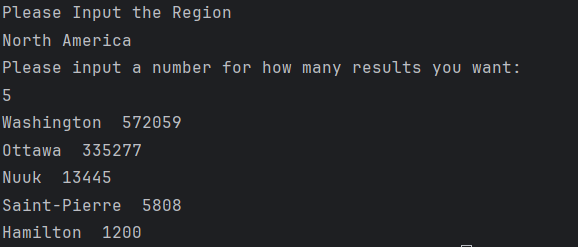 |
| 23 | The population of people, people living in cities, and people not living in cities in each continent. | yes     | 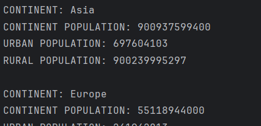 |
| 24 | The population of people, people living in cities, and people not living in cities in each region.    | yes     | 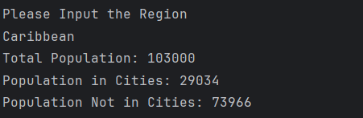 |
| 25 | The population of people, people living in cities, and people not living in cities in each country.   | yes     | 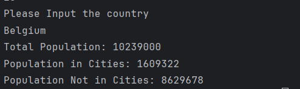 |
| 26 | The population of the world.                                                                          | yes     |  |
| 27 | The population of a continent.                                                                        | yes     | 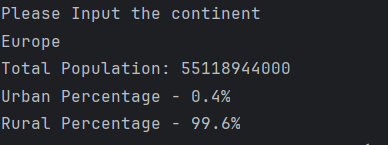 |
| 28 | The population of a region.                                                                           | yes     | 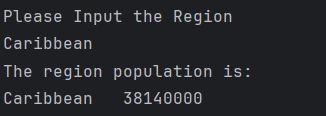 |
| 29 | The population of a country.                                                                          | yes     |  |
| 30 | The population of a district.                                                                         | yes     | 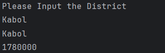 |
| 31 | The population of a city.                                                                             | yes     | 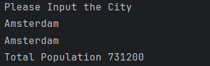 |
| 32 | The number of people who speak the top 5 languages, inc %                                             | yes     | 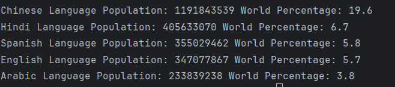 |

# 32 Requirements of 32 have been met, which is 100%